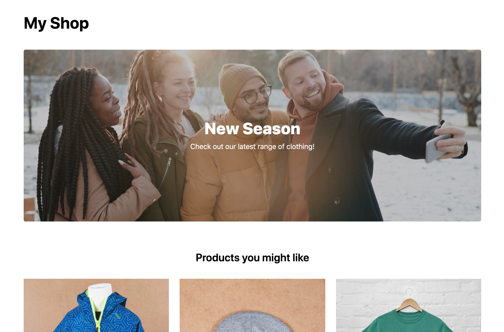

# Personalized E-Commerce Store Tutorial

This is the complete tutorial source code for creating a personalized e-commerce store using [LexasCMS](https://www.lexascms.com/), [Snipcart](https://snipcart.com/) and [Next.js](https://nextjs.org/).

  

## Tutorial

[Click here](https://snipcart.com/blog/headless-cms-personalization-lexascms) to open the tutorial.

## Live Demo

[Click here](https://lexascms-tutorial-snipcart.vercel.app/) to view a live demo of this repo.

## Deploy to Vercel

Of course, you can play around with this source code by deploying it to your own Vercel account. To do so, please follow the instructions below:

1. If you don't already have them, [create a LexasCMS account](https://app.lexascms.com/signup) and a [Snipcart account](https://app.snipcart.com/account/register)
2. Within LexasCMS:
    1. Create a new space using the **E-commerce Tutorial (Snipcart)** template
    2. Navigate to **Settings > General** and take note of your space ID
    3. Navigate to **Settings > API Keys** and create a new API Key (being sure to enable preview permissions). Take note of the generated API Key
3. From within your Snipcart dashboard, [navigate to your credentials](https://app.snipcart.com/dashboard/account/credentials) and take note of your API key
4. Click the below button and follow the instructions

